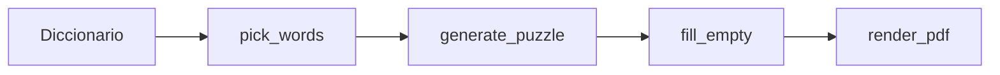

# # Amelie, Python Wordsearch-Generator | Generador de Sopa de Letras en español escrito en Python

Script autocontenido (`wordsworld.py`) que genera sopas de letras en PDF A4, listas para imprimir. Descarga un diccionario de palabras en español, coloca las palabras en una grilla (horizontal, vertical y diagonal) y dibuja el resultado con la lista de palabras a buscar debajo.

## Requisitos

```bash
pip install reportlab
```

## Uso rápido

```bash
# Generar una sopa (nivel medio por defecto)
python3 wordsworld.py

# Tres niveles de dificultad
python3 wordsworld.py --nivel facil   -o sopa-facil.pdf
python3 wordsworld.py --nivel medio   -o sopa-medio.pdf
python3 wordsworld.py --nivel dificil -o sopa-dificil.pdf

# Reproducir exactamente la misma sopa
python3 wordsworld.py --nivel dificil --semilla 42

# Título personalizado
python3 wordsworld.py --titulo "Sopa del domingo"

# Descargar/actualizar el diccionario manualmente
python3 wordsworld.py --descargar-diccionario
```

## Opciones de línea de comandos

| Opción | Descripción |
|--------|-------------|
| `--nivel {facil,medio,dificil}` | Nivel de dificultad (default: `medio`) |
| `-o`, `--output` | Archivo PDF de salida (default: `sopa-<nivel>.pdf`) |
| `--semilla` | Semilla aleatoria para reproducir la misma sopa |
| `--diccionario` | Ruta al archivo de palabras (default: `.wordsworld/es_palabras.txt`) |
| `--descargar-diccionario` | Solo descarga/actualiza el diccionario y termina |
| `--titulo` | Título personalizado en el PDF |
| `--sin-descarga` | No intentar descargar el diccionario si falta (usa lista de respaldo) |

## Niveles de dificultad

| Nivel | Grilla | Palabras | Largo palabras | Direcciones |
|-------|--------|----------|----------------|-------------|
| **facil** | 12×12 | 10 | 4–8 | Horizontal y vertical (↔ ↕) |
| **medio** | 15×15 | 15 | 4–10 | + diagonales (↘ ↙ ↗ ↖) |
| **dificil** | 18×18 | 20 | 5–12 | Las 8 direcciones (incluye invertidas) |

## Diccionario

En la primera ejecución, el script descarga automáticamente ~107 000 palabras del [Diccionario de la Lengua Española](https://dle.rae.es/) (vía [spanish-wordlist](https://github.com/studentenherz/spanish-wordlist)) y las guarda en:

```
.wordsworld/es_palabras.txt
```

Si no hay conexión a internet, se usa una lista de respaldo integrada con palabras comunes.

## Layout del PDF

- Formato **A4** con borde exterior autocontenido.
- **Grilla centrada** ocupando casi todo el ancho útil de la página.
- **Lista de palabras debajo** de la grilla, a ancho completo.
- Columnas adaptativas (2–5) según el largo de las palabras, para que no se corten al borde.
- Soporta **ñ, tildes y diéresis**.

---

## Cómo funciona el código

### Visión general



1. Filtra palabras del diccionario según nivel (cantidad, largo).
2. Intenta colocarlas una por una en una grilla vacía.
3. Rellena los huecos con letras aleatorias (camuflaje).
4. Dibuja el PDF.

### La grilla: una matriz de strings

La sopa es una lista de listas. Cada celda empieza como `" "` (vacía):

```python
grid = [[" " for _ in range(config.grid_size)] for _ in range(config.grid_size)]
```

No hay estructura especial para "conexiones". **Las conexiones surgen solas** cuando dos palabras comparten una celda con la misma letra.

### Direcciones como vectores

Cada dirección es un par `(dr, dc)` = cuánto avanzás en **fila** y **columna** por cada letra:

| `(dr, dc)` | Dirección |
|------------|-----------|
| `(0, 1)` | Horizontal → |
| `(0, -1)` | Horizontal ← |
| `(1, 0)` | Vertical ↓ |
| `(-1, 0)` | Vertical ↑ |
| `(1, 1)` | Diagonal ↘ |
| `(1, -1)` | Diagonal ↙ |
| `(-1, 1)` | Diagonal ↗ |
| `(-1, -1)` | Diagonal ↖ |

Para colocar `CASA` empezando en `(fila=3, col=5)` hacia la derecha `(0, 1)`:

| i | letra | fila | col |
|---|-------|------|-----|
| 0 | C | 3 | 5 |
| 1 | A | 3 | 6 |
| 2 | S | 3 | 7 |
| 3 | A | 3 | 8 |

Fórmula: `fila = row + dr * i`, `col = col + dc * i`.

### `fits`: la regla que permite cruces

Esta función es la clave. Para cada letra de la palabra pregunta:

1. ¿Sigue dentro de la grilla?
2. ¿La celda está vacía **o** ya tiene **exactamente esa misma letra**?

```python
def fits(grid, word, row, col, dr, dc):
    for i, letter in enumerate(word):
        r = row + dr * i
        c = col + dc * i
        if not (0 <= r < size and 0 <= c < size):
            return False
        cell = grid[r][c]
        if cell != " " and cell != letter:
            return False
    return True
```

Ejemplo de cruce:

```
     C
     A    ← "CASA" vertical
C A S A  ← "CASA" horizontal (comparten la C y la A)
```

Cuando la segunda palabra pasa por una celda que ya tiene `C`, `fits` dice OK porque `cell == letter`. Si hubiera una `X`, rechaza ese intento.

**No hay un algoritmo de "buscar intersecciones"**. Los cruces aparecen cuando el azar encuentra posiciones donde las letras coinciden.

### `try_place_word`: prueba y error aleatorio

Para cada palabra, baraja todas las posiciones `(fila, col)` y todas las direcciones permitidas, y prueba hasta encontrar la primera que encaje:

```python
def try_place_word(grid, word, directions, rng):
    positions = [(r, c) for r in range(size) for c in range(size)]
    rng.shuffle(positions)
    dirs = list(directions)
    rng.shuffle(dirs)
    for dr, dc in dirs:
        for row, col in positions:
            if fits(grid, word, row, col, dr, dc):
                place_word(grid, word, row, col, dr, dc)
                return Placement(word, row, col, dr, dc)
    return None
```

Si encuentra sitio, escribe las letras con `place_word` y guarda un `Placement` (palabra + origen + dirección). Si no, devuelve `None`.

Es un enfoque **greedy + aleatorio**: no optimiza la mejor disposición global; va colocando palabra por palabra en el primer hueco válido que encuentra.

### `generate_puzzle`: reintentos si algo falla

Como el orden importa (las primeras palabras ocupan sitio y condicionan las siguientes), si una palabra no entra, **tira todo y empieza de cero**:

```python
for attempt in range(config.max_attempts):  # hasta 800 intentos
    grid = grilla vacía
    ordered = palabras barajadas
    for word in ordered:
        placement = try_place_word(...)
        if placement is None:
            failed = True
            break
    if not failed:
        fill_empty(grid, rng)
        return Puzzle(...)
```

En cada intento:

- Grilla nueva.
- Orden de palabras distinto (shuffle).
- Mismas palabras, distinta disposición.

Por eso `--semilla 42` reproduce exactamente la misma sopa: fija todo el azar.

### `fill_empty`: letras de relleno

Las celdas que quedaron `" "` se llenan con letras aleatorias en español (con más peso en vocales y consonantes frecuentes). Eso hace que las palabras no resalten visualmente entre letras "basura".

### Selección de palabras del diccionario

Antes de armar la grilla, `pick_words` filtra del archivo descargado:

- Largo entre `min_len` y `max_len` del nivel.
- Solo letras válidas en español (incluye ñ y tildes).
- Sin repetir palabras.
- Cantidad según nivel (10 / 15 / 20).

El diccionario tiene ~107 000 entradas; el filtro deja un subconjunto enorme, y el shuffle elige al azar.

### El PDF

`render_pdf` solo **lee** la matriz ya armada y la dibuja celda por celda con ReportLab. No participa en la lógica de colocación. Calcula tamaños para A4, centra la grilla y pone la lista debajo con columnas adaptativas según el largo de las palabras.

---

## Resumen

| Concepto | Cómo se resuelve |
|----------|------------------|
| ¿Dónde va cada palabra? | Prueba aleatoria de posición + dirección |
| ¿Cómo se cruzan? | `fits` permite escribir sobre una celda si la letra coincide |
| ¿Qué pasa si no entra? | Reinicia la grilla y reordena palabras (hasta 800 intentos) |
| ¿Letras sueltas? | `fill_empty` las completa al final |
| ¿Reproducible? | `--semilla` fija el generador aleatorio |

Es un generador clásico de sopas: simple, efectivo, y los cruces son un efecto colateral de la regla "vacío o misma letra", no un paso aparte.

## Posibles mejoras

- Priorizar palabras que **compartan letras** entre sí (más cruces).
- Backtracking que elija la palabra más difícil de colocar primero.
- Temas/categorías (animales, comida, etc.).
- Página de soluciones opcional (`--solucion`).
